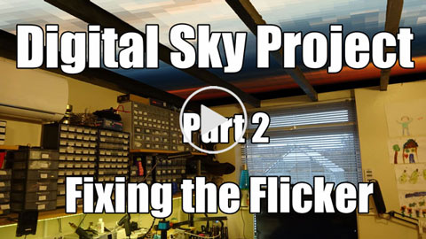
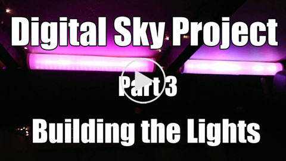
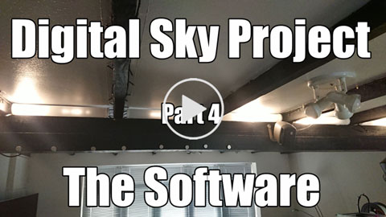
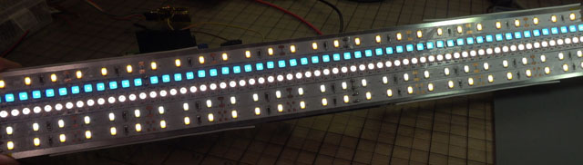

# Digital Sky

Digital Sky is a LED lighting project. 

<Pretty animated GIF goes here>

Indoor lighting is generally pretty sucky. This is evidenced by the massive variety of different types of light sources for all sorts of different environments. Cold white flourescents are common in workshops and offices. Bright halogens are popular in kitchens and bathrooms. Warmer softer colours are good for living rooms and bedrooms. And of course, in Northern climates there's also a booming market in SAD lamps to keep the winter blues away.

Outdoor lighting levels are not constant. Sometimes the sun will come out from behind a cloud and bathe you in glorious rays. Sometimes in the evenings the sky looks like it's on fire - all red and gold. When there's a storm brewing the world turns grey and purple.

People want a lot of different things from their indoor lighting depending on what task they're doing. In a home environment warm white is the most popular choice, but in a workshop environment a daylight white gives better colour balance and helps keep people alert. Photography and filming call for very specific colour temperatures, whereas parties and general decoration call for a whole range of different colours and intensities.

The goal of the Digital Sky project is to have one set of lights which can do it all.

A set of YouTube videos describe the project hardware in detail.

This repository contains the software component to run the Digital Sky lamps.

## The Hardware
The Digital Sky hardware consists of strips of WS2812 individually addressable RGBW LED Pixels used in conjunction with WS2811 PWM LED driver ICs which are used to feed dedicated Warm-White, Natural-White, Daylight-White and Ice-Blue (SAD LAMP) strips of high efficiency, high-CRI LEDs. 

The strips are broken out into lamp modules which each contain 64 individually addressable LED pixels combined with four WW/NW/DW/IB strips for high intensity lighting. The lamp modules measure 500mm x 55mm each, comsuming over 60W of power when all LEDs are lit, and offering somewhere around 4000 lumens of light output. 

The combination of high efficiency white strips with RGBW addressable pixels allows for a good combination of high intensity lighting during working hours and relaxed hypnotic lighting effects in the evenings (or for parties)

## The Software
The controller software works in a way that is similar music production software (Ableton, Cuebase, Garageband etc), mixing together multiple animation channels and layering filters and effects on top. Lighting animations may be thought of as being similar to music samples. Samples may be looped, faded in & out or mixed together. Lighting animations can be treated the same way. We process our lighting animations 100 times per second.

All 'animation' plugins are required to have an emit_row() function, which when called will emit the pixel values for an entire strip of RGBW pixels.
Each time the emit_row() function is called, they must emit the next row in their sequence.
Multiple animations may be running at the same time.
The maximum pixel colour value from each animation will be the one which is displayed (i.e. if one animation sets green to 50% and another sets 75% then the result will be 75%)

A similar set of 'strip_animations' are for setting the values for the Warm-White, Natural-White, Daylight-White and Ice-Blue elements on each lamp. As with the RGBW animations, the highest value for each pixel channel will be the one which gets displayed.

(in the future, when I write more code) Filters may be attached to the output of any 'animation' or 'strip_animation' to perform simple operations such as reducing brightness or shifting colour balance. 

The Digital Sky controller software also subscribes to an MQTT message bus and listens out for messages sent by a Snips voice assistant. Snips runs totally locally on the raspberry PI and allows for voice control over the lamps.

This link probably won't work for you because I haven't published the agent yet, but I'm putting it here for myself so that I don't loose it.

https://console.snips.ai/assistant/proj_VXNK6aedOw4/app/skill_o6OlPAP64KP/edit 

The Digital Sky control software uses jgarff's rpi_ws281x library ( https://github.com/jgarff/rpi_ws281x ) for the low level strip control.
This software is built on the Twisted Matrix Python Asychronous Event-Driven Framework ( https://twistedmatrix.com/trac/ )

## Usage

Root privileges are required for access to GPIO line, so running as a daemon is highly recommended.
There is a sample init.d script in the extras/ folder. Copy it to /etc/init.d and rename it to something nicer. Update file paths to suit your locations.
Generate a set of ssh keys using ssh-keygen and save them in the ssh-keys folder. The filenames of these keys should be stored in settings.py
Take your own personal ssh public key, and save that into the ssh-keys folder as client_rsa.pub (or a different name as long as you update settings.py)

Start software up with /etc/init.d/digital_sky start
Use the update-rc.d command to configure auto-start at boot time.

Once the daemon is started, ssh into port 5022 on your pi.
Type 'help' for more

## Contributing

Yes please. Contributions welcome through normal git workflow (fork, pull request etc) providing that they are also MIT licensed.  
